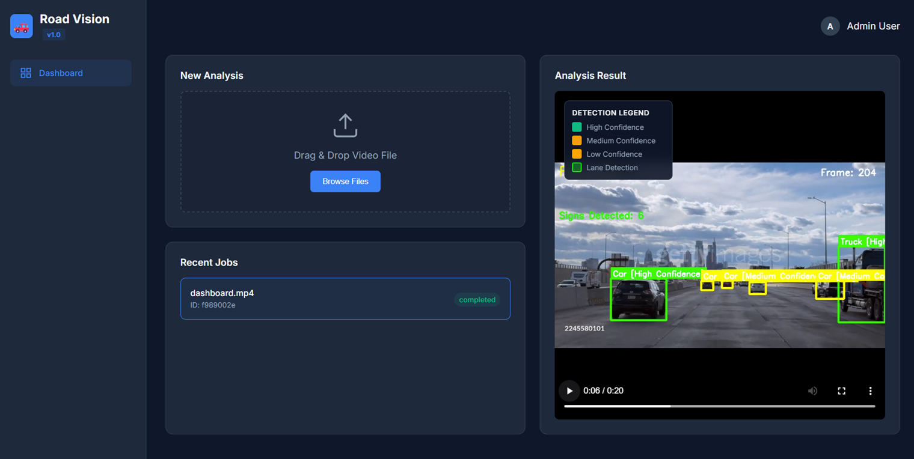

# 🚗 Road Vision v1.0

**Road Vision v1.0** is an enterprise-grade video analysis system designed for autonomous driving research and traffic monitoring. It features a robust FastAPI backend, asynchronous video processing, and a modern "Command Center" dashboard for visualizing lane detection, traffic sign recognition, and vehicle tracking.



## ✨ Features

*   **Advanced Lane Detection**: Uses computer vision (Sobel gradients, HLS color space) and sliding window search to detect and predict lane curvature.
*   **Traffic Sign Recognition**: Integrated YOLOv8 model for real-time detection and classification of traffic signs.
*   **Vehicle Detection**: Identifies and tracks vehicles (Cars, Trucks, Buses, etc.) with high accuracy.
*   **Confidence Scoring**: Color-coded bounding boxes indicating detection confidence (Green: High, Yellow: Medium, Orange: Low).
*   **Enterprise Dashboard**: Dark-themed, responsive web interface for uploading videos, managing jobs, and viewing results.
*   **Asynchronous Processing**: Non-blocking video processing pipeline using background tasks.

## 🛠️ Tech Stack

*   **Backend**: Python 3.10+, FastAPI, Uvicorn
*   **Computer Vision**: OpenCV, NumPy, Ultralytics YOLOv8
*   **Frontend**: HTML5, CSS3 (Modern Dark Theme), Vanilla JavaScript
*   **Deployment**: Ready for local deployment or cloud hosting

## 🚀 Installation

1.  **Clone the repository:**
    ```bash
    git clone https://github.com/MStaR3125/RoadVision.git
    cd RoadVision
    ```

2.  **Create a virtual environment (optional but recommended):**
    ```bash
    python -m venv venv
    # Windows
    venv\Scripts\activate
    # macOS/Linux
    source venv/bin/activate
    ```

3.  **Install dependencies:**
    ```bash
    pip install -r requirements.txt
    ```

4.  **Download YOLOv8 Model:**
    The system automatically downloads `yolov8n.pt` on the first run, or you can place it in the `data/models/` directory.

## 💻 Usage

1.  **Start the server:**
    ```bash
    uvicorn backend.main:app --reload
    ```

2.  **Open the dashboard:**
    Navigate to `http://localhost:8000` in your web browser.

3.  **Analyze a Video:**
    *   Drag and drop a video file (mp4, avi, etc.) into the upload zone.
    *   Wait for the processing to complete (status will change to "completed").
    *   Click on the job to view the analyzed video with overlay visualizations.

## 📂 Project Structure

```
RoadVision/
├── backend/            # FastAPI application and CV logic
│   ├── main.py         # API entry point
│   ├── processor.py    # Video processing pipeline
│   ├── lane_detector.py# Lane detection algorithms
│   └── ...
├── frontend/           # Web dashboard assets
│   ├── index.html      # Main dashboard interface
│   └── static/         # CSS, JS, and images
├── data/               # Data storage (models, uploads, results)
├── requirements.txt    # Python dependencies
└── README.md           # Project documentation
```

## 🤝 Contributing

Contributions are welcome! Please fork the repository and submit a pull request.

## 📄 License

This project is licensed under the MIT License.
